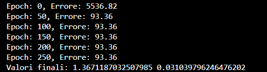
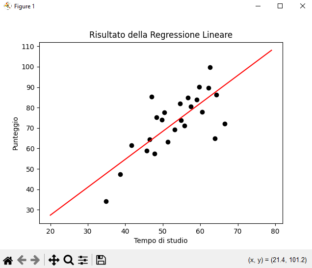

  
    
  <i>First experiment with Machine Learning basics, 
  implementing Linear Regression from scratch with Python.</i>

---

# 📖 Index
- 📌 [Overview](#-overview)  
- 📥 [Download & Installation](#-download--installation)  
- 📷 [Usage Examples](#-usage-examples)  
- 📄 [License](#-license)  

---

# 📌 Overview

**Linear Regression Project** is a simple implementation of **linear regression** using **Python**, built **from scratch** without libraries like `scikit-learn`.  

The project demonstrates:  
- 📊 Calculation of the **Mean Squared Error (MSE)**  
- 🔄 Parameter optimization using **Gradient Descent**  
- 📈 Visualization of the regression line compared to real data  

Dataset example:  
- `studytime` → hours of study  
- `score` → exam/test score  

---

# 📥 Download & Installation

**⚠️ Python 3.x is required on the machine to run this project.**

1. Download the latest LinearRegression folder (includes all files and the batch file).
2. Make sure Python 3.x is installed and added to your system PATH.
3. Open the folder and double-click run_sentiment_analyzer.bat to start the application.
   
On first run, the batch file will install the required Python packages (from requirements.txt) and download the Hugging Face models (Internet connection required). After that, the app works offline.
Place your dataset as data.csv in the project folder(The CSV must contain at least two columns)

# 📷 Usage Examples
  

**Example Output (Console)**
Epoch: 0, Errore: 250.36
Epoch: 50, Errore: 145.82
Epoch: 100, Errore: 98.54
...
Valori finali: 1.23  10.45

**Graphical Output**
  

The script will plot:

⚫ Data points (hours of study vs. score)

🔴 Best-fit regression line (calculated via gradient descent)

# 📄 License

Released under the MIT License.
Feel free to use, modify, and share 🚀
